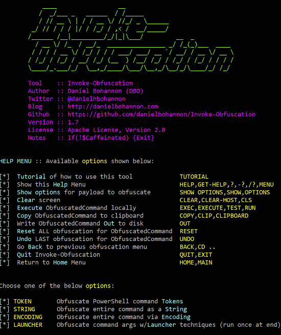
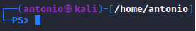
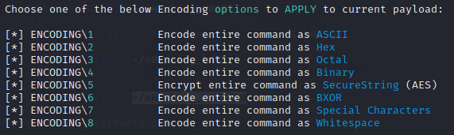
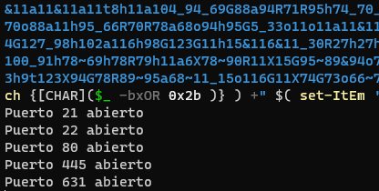
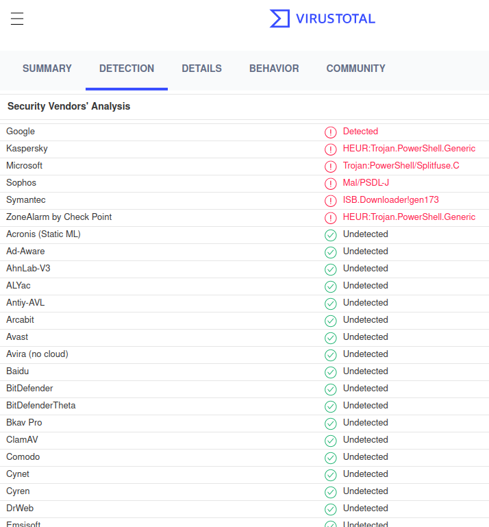
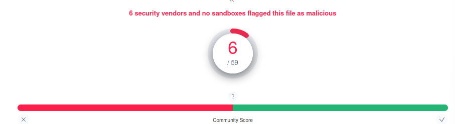

# Explotar vulnerabilidad CVE-2015-3306 presente en ProFTPD 1.3.5.

Requisitos:
1. Máquina ***Router-Ubu***.
2. Máquina ***Kali Linux***.
3. Máquina ***Win 11***.
4. Máquina ***Metasploitable3_ubu1404***.

La ejecución de scripts maliciosos de PowerShell viene siendo bien detectada por las herramientas de seguridad, como el ***antivirus*** o el ***IDS***.

## Ejercicio 1: Crear un script de PowerShell que sondee los puertos.

Asegúrate que en la máquina ***Win 11*** tienes clonado el repo de Github con los archivos del curso. Si no es así o no lo tienes claro, mira el ***Ejercicio 11: Clonado del repositorio de GitHub.*** del ***lab-00.md***.

Abre una terminal de ***PowerShell*** como ***ADMINISTRADOR*** y habilita la ejecución de scripts en la máquina.
(Nota: Responde con ***Yes to All*** a la pregunta.)
```
Set-ExecutionPolicy -ExecutionPolicy RemoteSigned
```

Cierra la terminal ***Administrator: Windows PowerShell***. Abre ***PowerShell ISE*** y carga el script ***testports.ps1*** que se encuentra en la carpeta ***50***.

Ejecuta el script con ***F5***. Este script sondea los 1000 primeros puertos. Si lees el código fuente lo entenderás, de la misma forma que un ***antivirus*** haría.

El objetivo es ***ofuscar*** (esconder) el código fuente, de forma que no se pueda "entender" por el software que lo está analizando. 

En este laboratorio hacemos un simple sondeo de puertos, pero la realidad es que existe mucho malware malicioso basado en PowerShell, que también usa técnicas similares de ofuscación para que no sea detectado.

## Ejercicio 2: Ofuscar el malware.

Vamos a proceder a la ofuscación. Para ello aprovecharemos un proyecto publicado en https://github.com/danielbohannon/Invoke-Obfuscation
(Nota: Detén el sondeo de puertos con ***CTRL+C***.)



En la máquina ***Kali***, asegúrate que también tienes clonado el repo de Github con los archivos del curso. Si no es así o no lo tienes claro, mira el ***Ejercicio 11: Clonado del repositorio de GitHub.*** del ***lab-00.md***.

Vamos a instalar el módulo de  ofuscación en ***Kali***. Entramos en el directorio ***Descargas***
```
cd ~/Downloads

git clone https://github.com/danielbohannon/Invoke-Obfuscation.git
```

Abrimos una sesión de ***PowerShell*** con el siguiente comando.
```
pwsh
```

Debe aparecer el prompt característico.



Movemos los archivos del proyecto en la carpeta de módulos de ***PowerShell***.
```
mv ~/Downloads/Invoke-Obfuscation $HOME/.local/share/powershell/Modules

cd ~
```

Lanzamos la aplicación. En el prompt de ***PowerShell*** escribimos el comando.
```
Import-Module Invoke-Obfuscation

Invoke-Obfuscation
```

Lo primero que debemos proporcionar es el archivo con nuestro "malware". En el prompt de ***Invoke-Obfuscation*** escribimos.
```
set SCRIPTPATH ~/eHacking_LABS/50/testPorts.ps1
```

Como podremos apreciar se nos ofrece varias formas de ofuscar el script original. Elegimos ***Compress***.
```
COMPRESS
```

Solo hay una opción disponible ***COMPRESS\1***. La seleccionamos poniendo ***1***.
```
1
```

Podrás observar cómo aparece ofuscado el script. Necesitamos llevarlo a la víctima y para ello hacemos uso del portapapeles.
(Nota: En realidad, el actor de amenaza utilizará los vectores más habituales para hacer llegar el ***PowerShell*** a la víctima.)

Con mucho cuidado, seleccionamos con el ratón el payload y lo copiamos al portapapeles.
(Nota: El payload de de color violeta y aparece después del texto ***Result:***.)


En la máquina ***Win 11***, abrimos una terminal de ***PowerShell***. En ella ***Pegamos*** la selección que tenemos en el portapapeles y pulsamos ***ENTER***.

Afortunadamente ***Microsoft Defender*** advierte el engaño y no ejecuta el script.


Volvemos de nuevo a la máquina ***Kali***. 

Salimos del menú ***Compress***.
```
BACK
```

Y entramos en el de codificación.
```
ENCODING
```

Aparecen las siguientes opciones.



Elegimos la codificación ***BXOR***, así que elegimos la opción ***6***.
(Nota: La herramienta va añadiendo ofuscaciones. En este momento tenemos una ***Compresión*** y una ***Codificación BXOR***.)
```
6
```

Cuando termine de general la ofuscación, comprobarás que la salida es bastante larga. Al igual que antes, selecciónala entera y cópiala al portapapeles.

De nuevo en la máquina ***Win 11***, pegamos la selección en la ventala de ***PowerShell***, y pulsamos ***ENTER***.

Como resultado comprobarás que el script se está ejecutando sin problemas y que ***Microsoft Defender*** no lo ha detectado. :(



## Ejercicio 3: Determinar qué antivirus detectan la ofuscación.

Como miembro del ***Equipo Azul*** debes haber sacado algo muy claro de esto. El antivirus no es perfecto. Detectar una ofuscación de código fuente no es tan sencilla.

En la máquina ***Kali*** selecciona y copia en el portapapeles el último ***payload***.

Abre otra terminal (para no perder la de ***PowerShell***) y en ella, invoca al editor ***nano***.
```
nano
```

En nano ***Pega*** el portapapeles. Ten cuidado porque todo el payload está en una única línea y puede parecerte que solo se ha copiado usa serie de caracteres. Si te desplazas hacia la izquierda verás todo el payload.

Guardar el archivo pulsando ***CTRL+X*** y ***Y***. Como nombre de archivo escribe el siguiente y pulsa ***ENTER***.
```
~/payload.ps1
```

¿Quieres conocer si tu antivirus es "bueno"?. Abre el navegador y conéctate a la siguiente URL.
```
https://www.virustotal.com
```

Sube el archivo ***payload.ps1*** y analízalo. En resultado no puede ser más desalentador.



En este ejemplo, solo ***6*** de ***59*** motores detectaron la amenaza. No cantes victoria si tu antivirus aparece en la lista de los que han detectado el malware, porque con una técnica de ofuscación diferente, lo mismo no lo detecta.



***ACTIVIDAD***

Explora el resto de la herramienta ***Invoke-Obfuscation*** y determina el grado de acierto de los antivirus para los payloads que diseñes.

***FIN ACTIVIDAD***

***ACTIVIDAD***

Como administrador puedes tener la tentación de prohibir la ejecución de scripts de PowerShell en los equipos de los usuarios. Si bien es una medida muy drástica que cumple con la finalidad que buscamos, se pierde una gran parte de la administración moderna de los sistamas, que está basada en PowerShell. ¿Qué solución debería implementarse en la organización para minimizar el riesgo de la ejecución de scripts de PowerShell?

***FIN ACTIVIDAD***

***FIN DEL LABORATORIO***