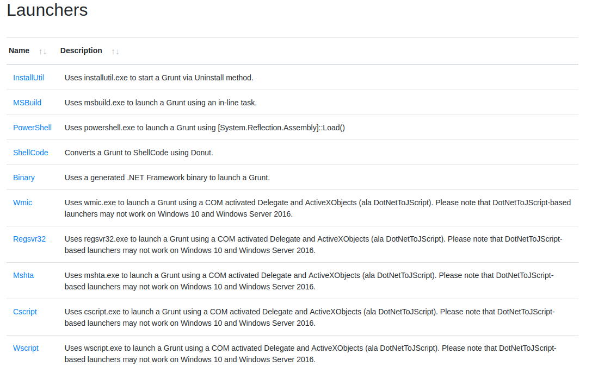
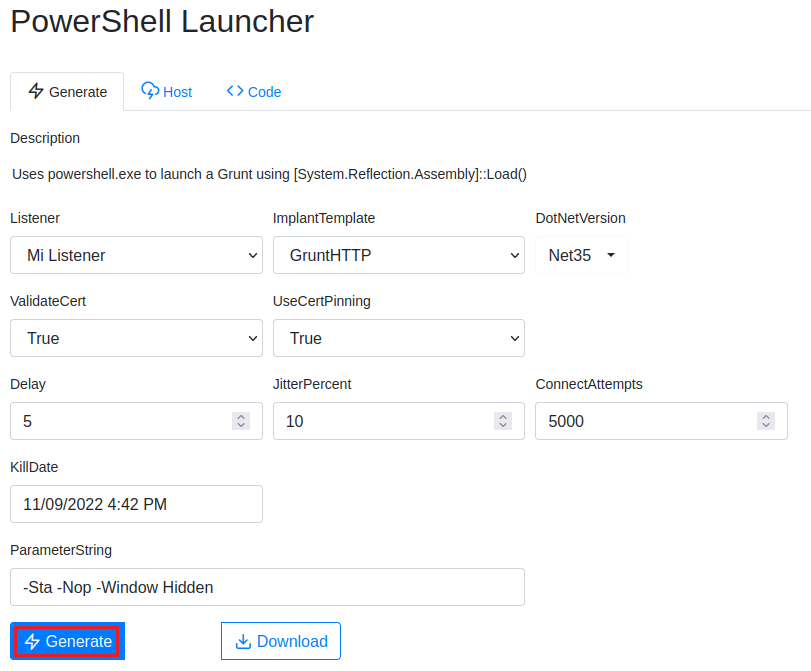
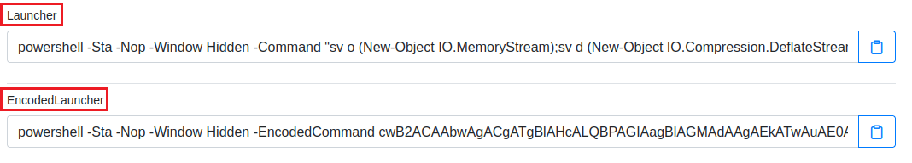
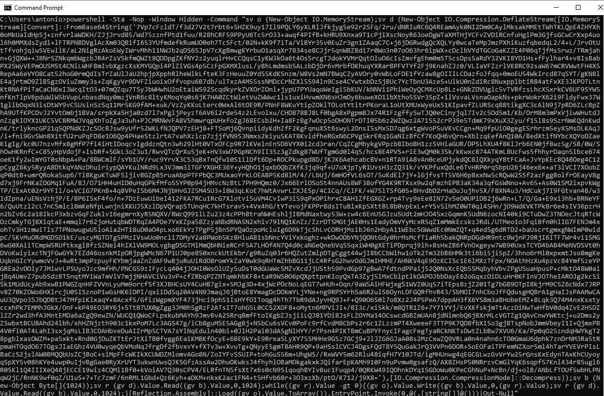
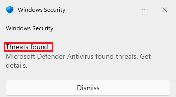

# 4. Covenant C2
   
   

Requisitos:
1. Máquina ***Router-Ubu***.
2. Máquina ***Kali Linux***.
3. Máquina ***Windows 11***

***Covenant*** es un framework de command and control (C2), usado para actividades de redteam, postexplotacion y movimiento lateral.

El objetivo del proyecto es resaltar la superficie de ataque de .NET (como en su momento lo hizo Empire con Powershell). Esta desarrollado en ***ASP.NET Core***, como aplicación multi plataforma y cuenta con una interfaz web multi usuario.

Cuenta con funcionalidades para diferentes dispositivos y sistemas operativos, incluyendo Windows, Unix y OSX (en los últimos dos siempre que se cumplan ciertas dependencias).

La arquitectura es similar a otros Command and control, en su propia terminología consta de ***Listeners***, que escuchan conexiones recibidas desde ***grunts*** (agentes funcionando en equipos victima).

Para iniciar la comunicación con el C2 se utilizan ***Launchers*** que son piezas que permiten lanzar la funcionalidad inicial para conectar los grunts con listeners. Los grunts pueden comunicarse con listeners utilizando diferentes protocolos, entre ellos HTTP, HTTPs y SMB.


En este link https://github.com/cobbr/Covenant tienes el proyecto.


## Ejercicio 1: Instalación de Covenant en Kali Linux.

En primer lugar debemos agrefar las claves de firma para poder descargar el paquete del ***SDK*** de ***.NET Core V3.1***.

En la máquina ***Kali*** abrimos una terminal y ejecutamos el siguiente comando.
```
wget https://packages.microsoft.com/config/debian/11/packages-microsoft-prod.deb -O packages-microsoft-prod.deb
```

Instalamos el paquete.
```
sudo dpkg -i packages-microsoft-prod.deb
```

Borramos el paquete descargado.
```
rm packages-microsoft-prod.deb
```

Procedemos a instalar el ***SDK***.
```
sudo apt-get update &&  sudo apt-get install -y dotnet-sdk-6.0
```

El entorno de ejecución de ***ASP.NET Core*** le permite ejecutar aplicaciones creadas con ***.NET*** en las que no se ha proporcionado el entorno de ejecución. Los comandos siguientes instalan el entorno de ejecución de ***ASP.NET Core***, el más compatible con .NET. En el terminal, ejecutamos los siguiente comandos.
```
sudo apt-get update && sudo apt-get install -y aspnetcore-runtime-6.0
```

Procedemos a clonar el repositorio de ***Covenant***. En la terminal, escribimos.
```
git clone --recurse-submodules https://github.com/cobbr/Covenant
```

y lo ejecutamos.

Nota: Tened paciencia, tarda unos minutos en iniciarse.
```
cd Covenant/Covenant

sudo dotnet run
```

Debemos esperar hasta ver el siguiente mensaje, donde se indica la forma de conectar con el servidor.


Abrimos el navegador y conectamos a la siguiente URL.

Nota: Ignorar la advertencia de certificado. Es debido a que se usa un certificado autofirmado.
```
https://127.0.0.1:7443
```

En la pantalla inicial debemos registrar un usuario, que será en administrador de ***Covenant***. Poner como usuario 
```
antonio
```

y password
```
Pa55w.rd
```

## Ejercicio 2: Crear un Listener e inicializar un Grunt.

Los ***Listeners*** son similares a los handlers que utiliza ***Metasploit***. En en panel lateral seleccionamos ***Listeners*** y luego hacemos clic en ***Create***.


Configuramos el ***Listener*** de la siguiente forma.

* *Name*: Nombre con el que se identificara el listener. Escribimos ***Mi Listener***.
* *Bind Address*: IPs a las que se vinculará el listener (0.0.0.0 para todas las IPs del equipo)
* *Bind Port*: Es el puerto local al que el listener se enlazará.
* *Connection port*: puerto al que se conectará el ***Grunt***.
* *Connect Address*: La o las IPs que estarán esperando conexiones. Aceptamos en valor propuesto ***192.168.20.9***.
* * UseSSL*: si el trafico será cifrado utilizando SSL. No lo usamos por simplicidad.
* *HttpProfile*: Determina el compornamiento del grunt y del listener. Lo ignoramos.

Hacemos clic en ***Create*** para crear el listener.

Los ***Launchers*** se utilizan para generar, alojar y descargar los ***grunts*** (agentes), sería el equivalente a los ***payloads*** de ***Metasploit***.

Una cosa a tener en cuenta sobre ***Covenant*** cuando se habla de ***Lauchers*** es que el framework no tiene ninguna funcionalidad diseñada para ayudar a explotar las vulnerabilidades, como si hace ***Metasploit***. ***Covenant*** está centrado exclusivamente en la postexplotación; tenemos que encontrar nuestra propia manera de ejecutar nuestros ***Launchers**** en los sistemas de destino. 

Para crear un Launcher hacemos clic en ***Launchers***, en el panel izquierdo. 

Como puede observarse en la imagen, ***Covenant*** permite crear los ***Launchers*** de diferente forma.



Los launchers pueden ser de distinto tipo, es importante personalizar el ataque para conseguir una mayor efectividad, por ejemplo si el equipo donde queremos ejecutar el launcher es un Windows 10 deberemos ajustar la versión de ***dotNetFrameworkVersion***.

Otro aspecto interesante es que podemos ver el código fuente del launcher clickeando sobre la solapa ***code***. Esto puede ser particularmente útil si queremos ofuscar o implementar técnicas de bypass y compilar por nuestra parte el launcher.

Estas versiones compiladas pueden luego ser alojadas y servidas por el servicio http de covenant.

Los diferentes tipos de ***Launchers*** son:

* *Binary*: Se utiliza para generar un ejecutable que será el que lance en ***Grunt***. 
* *ShellCode*: Convierte un binario Grunt a Shellcode usando DonutShellCode using Donut (https://thewover.github.io/Introducing-Donut/).
* *PowerShell*: Genera un script de PowerShell que lanza un Grunt (usa powershell.exe).
* *MSBuild*: Genera un archivo XML de MSBuild que lanza al Grunt por medio de ***msbuild.exe***.
* *InstallUtil*: Genera un archivo XML de ***InstallUtil*** que lanza el Grunt (https://learn.microsoft.com/es-es/dotnet/framework/tools/installutil-exe-installer-tool)
* *Mshta*: Genera un archivo HTA file que lanza el Grunt usando ***mshta.exe***. Depende de ***DotNetToJScript*** (https://codewhitesec.blogspot.com/2018/07/lethalhta.html).
* *Regsvr32*: Lanza el Grunt usando ***regsvr32.exe***.
* *Wmic*: Lanza al Grunt using ***wmic.exe*** (https://learn.microsoft.com/es-es/windows-server/administration/windows-commands/wmic)
* *Cscript*: Lanza al Grunt usando un archivo ***JScript*** por medio de ***cscript.exe***.
* *Wscript*: Lanza al Grunt usando un archivo ***JScript*** por medio de ***wscript.exe***.

Elegimos el Launcher ***PowerShell***, tal y como se puede observar en la siguiente imagen.


* *Listener*: Es el nombre del Listener al que se conectará en Grunt. Seleccionamos el que hemos creado en el paso anterior (***Mi Listener***)
* *ImplantTemplate*: Es el método (implante) que usará el Launcher para inyectar el Grunt. Puede ser ***Grunt HTTP*** o ***GRUNT SMB***.
* *DotNetVersion*: - Versión en la que se generará el implante (***3.5*** o ***4.0***)
* *Delay*: Tiempo en el que el Grunt estará en reposo antes de volver sondear al servivor para recibir las tareas.
* *JitterPercent*: Porcentaje de variabilidad para el valor ***Delay***.
* *ConnectAttempts*:  Número de veces consecutivas en las que el Grunt intentará sondear al Listener antes de dejar de hacerlo.
* *KillDate*: Fecha en la que el Grunt dejará de funcionar y ya no sondeará más a su Listener.

Hay otras opciones que aparecen o no en función de la configuración elegida.

* *ValidateCert*: Indica si el Grunt verificará el certificado digital de su Listener. El objetivo es prevenir ataques MitM.
* *UseCertPinning*:  Determina i el Grunt usara ***pinning*** de certificado para evitar ataques MitM (https://sectigo.com/resource-library/what-is-certificate-pinning)
* *SMBPipeName*: Si se usa ***SMB*** como plantilla para el implante, este campo determina el nombre de la conexión a la que se enlazará en Grunt.

Dejamos los valores como se muestra en la siguiente imagen.



Al hacer clic en el botón ***Generate***, se muestran la versión ***normal*** del launcher y la ***ofuscada***, que tiene la finalidad de intentar evadir al Antivirus.

Nota: Disponemos de sendos botones para copiar en el portapapeles el ***Launcher*** que nos interese. También tenemos el botón ***Download*** que descargará el script de PowerShell.




Vamos a intentar poner a funcionar todo esto. Copiamos en el portapapeles la versión del ***Launcher*** sin ofuscar. A continuación, en la máquina ***Win 11***, abrimos una terminal de comandos (no de PowerShell) y pegamos el contenido del portapapeles. El resultado es similar al mostrado en la siguiente imagen.



Solo debemos pulsar ***Enter*** para que se ejecute el script, la víctima se conecte al ***Listener*** y este le descargue el ***Grunt***.

No tardará mucho rato en aparecer un mensaje ***Microsoft Defender*** indicando que el ***Grunt*** que se está intentando inyectar es una amenaza.



Esta es una buena noticia para el equipo Azul. 

No obstante recordemos que ***Covenant*** es una herramienta de ***PostExploitation***. Es de suponer que hemos comprometido a la víctima con otras herramientas, al punto de hacer que el antivirus no funcione correctamente.

Vamos a intentar realizar algo muy interesante, que no es otra cosa, que hacer que ***Microsoft Defender*** reconozca como benigno algo que no lo es.

## Ejercicio 3: Evadir al antivirus alterando AMSI.


Para evadir al AV: https://www.youtube.com/watch?v=Fi0jXm8VOFU&list=WL&index=8


