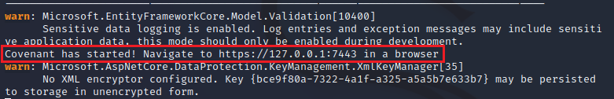
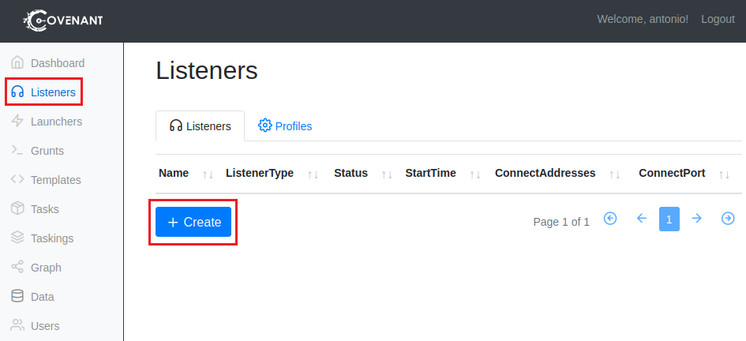

# 4. Covenant C2
   
   

Requisitos:
1. Máquina ***Router-Ubu***.
2. Máquina ***Kali Linux***.
3. Máquina ***Windows 11***

***Covenant*** es un framework de command and control (C2), usado para actividades de redteam, postexplotacion y movimiento lateral.

El objetivo del proyecto es resaltar la superficie de ataque de .NET (como en su momento lo hizo Empire con Powershell). Esta desarrollado en ***ASP.NET Core***, como aplicación multi plataforma y cuenta con una interfaz web multi usuario.

Cuenta con funcionalidades para diferentes dispositivos y sistemas operativos, incluyendo Windows, Unix y OSX (en los últimos dos siempre que se cumplan ciertas dependencias).

La arquitectura es similar a otros Command and control, en su propia terminología consta de ***Listeners***, que escuchan conexiones recibidas desde ***grunts*** (agentes funcionando en equipos victima).

Para iniciar la comunicación con el C2 se utilizan ***Launchers*** que son piezas que permiten lanzar la funcionalidad inicial para conectar los grunts con listeners. Los grunts pueden comunicarse con listeners utilizando diferentes protocolos, entre ellos HTTP, HTTPs y SMB.

En este link https://github.com/cobbr/Covenant tienes el proyecto.


## Ejercicio 1: Instalación de Covenant en Kali Linux.

En primer lugar debemos agrefar las claves de firma para poder descargar el paquete del ***SDK*** de ***.NET Core V3.1***.

En la máquina ***Kali*** abrimos una terminal y ejecutamos el siguiente comando.
```
wget https://packages.microsoft.com/config/debian/11/packages-microsoft-prod.deb -O packages-microsoft-prod.deb
```

Instalamos el paquete.
```
sudo dpkg -i packages-microsoft-prod.deb
```

Borramos el paquete descargado.
```
rm packages-microsoft-prod.deb
```

Procedemos a instalar el ***SDK***.
```
sudo apt-get update &&  sudo apt-get install -y dotnet-sdk-6.0
```

El entorno de ejecución de ***ASP.NET Core*** le permite ejecutar aplicaciones creadas con ***.NET*** en las que no se ha proporcionado el entorno de ejecución. Los comandos siguientes instalan el entorno de ejecución de ASP.NET Core, el más compatible con .NET. En el terminal, ejecutamos los siguiente comandos.
```
sudo apt-get update && sudo apt-get install -y aspnetcore-runtime-6.0
```

Procedemos a clonar el repositorio de ***Covenant***. En la terminal, escribimos.
```
git clone --recurse-submodules https://github.com/cobbr/Covenant
```

y lo ejecutamos.

Nota: Tened paciencia, tarda unos minutos en iniciarse.
```
cd Covenant/Covenant

sudo dotnet run
```

Debemos esperar hasta ver el siguiente mensaje, donde se indica la forma de conectar con el servidor.



Abrimos el navegador y conectamos a la siguiente URL.

Nota: Ignorar la advertencia de certificado. Es debido a que se usa un certificado autofirmado.
```
https://127.0.0.1:7443
```

En la pantalla inicial debemos registrar un usuario, que será en administrador de ***Covenant***. Poner como usuario 
```
antonio
```

y password
```
Pa55w.rd
```

## Ejercicio 2: Crear un Listener e inicializar un Grunt.

Los ***Listeners*** son similares a los handlers que utiliza ***Metasploit***. En en panel lateral seleccionamos ***Listeners*** y luego hacemos clic en ***Create***.



Configuramos el ***Listener*** de la siguiente forma.

* *Name*: Nombre con el que se identificara el listener. Escribimos ***Mi Listener***.
* *Bind Address*: IPs a las que se vinculará el listener (0.0.0.0 para todas las IPs del equipo)
* *Bind Port*: Es el puerto local al que el listener se enlazará.
* *Connection port*: puerto al que se conectará el ***Grunt***.
* *Connect Address*: La o las IPs que estarán esperando conexiones. Aceptamos en valor propuesto ***192.168.20.9***.
* UseSSL*: si el trafico será cifrado utilizando SSL. No lo usamos por simplicidad.
* *HttpProfile*: Determina el compornamiento del grunt y del listener. Lo ignoramos.

Hacemos clic en ***Create*** para crear el listener.

https://www.blackmantisecurity.com/covenant-command-and-control-en-kali/

Para evadir al AV: https://www.youtube.com/watch?v=Fi0jXm8VOFU&list=WL&index=8


